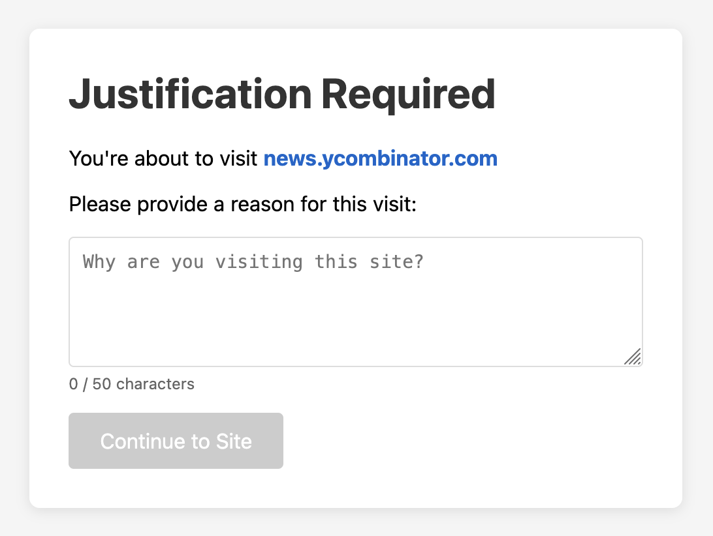

# Second Thought

Browser extension (Firefox and Chrome) that forces users to justify visiting distracting websites.

## Motivation

I developed a bad habit of semi-consciously opening distracting sites like Reddit or HackerNews when bored. Instead of completely blocking them from my laptop, I wanted to force myself to justify the visit so I could still have access when I had a legitimate reason. This was inspired by self-approval with justification access control systems.

## Approach

A simple, configurable blocklist of sites is maintained. When the browser attempts to navigate to one of them, the user is instead directed to a page to enter a 50+ character reason. Once provided, the user continues through. The block resets after a default 15 minutes.

<p align="center">
  
</p>


This design is not intended to be a strong block, but a way to add friction in an ecosystem designed to hook the user. Personally, this solution has been very effective at forcing me to give my browsing habits a second thought.

## Building

```sh
./build.sh
```

This produces loadable bundles in `dist/firefox` and `dist/chrome`. Load them via `about:debugging` (Firefox) or `chrome://extensions` → "Load unpacked" (Chrome).
